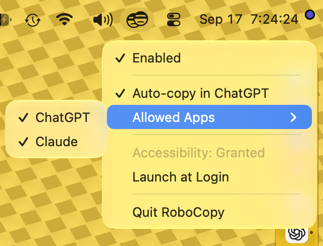

# RoboCopy

RoboCopy adds iTerm-style copy-on-mouse-select behavior to explicitly allowed macOS applications.

<p align="center">
  
</p>

## Download

[Download RoboCopy for Apple silicon](https://github.com/darinkelkhoff/roboCopy/releases/latest/download/RoboCopy-macos-arm64.zip) (macOS 14 or later)

Unzip the archive, move `RoboCopy.app` to `/Applications`, launch it, and grant Accessibility access when prompted.

## Requirements

- macOS 14 or later
- To build from source:  Xcode 15.3 or later, or equivalent Xcode Command Line Tools

## Build

```bash
scripts/build-macos-app.sh
```

The app is written to `dist/RoboCopy.app`. Move it to `/Applications` before enabling Launch at Login so macOS has a stable bundle location.

The build generates the macOS application icon and adaptive menu-bar template image from the committed SVG sources using AppKit, `sips`, and `iconutil`.

When exactly one Apple Development identity is installed, the build selects it automatically. This stable identity allows macOS to recognize rebuilt versions as the same app for privacy permissions such as Accessibility. If no development identity is available, the build uses ad-hoc signing and prints a warning. If multiple identities are available, select one explicitly:

Override the signing identity when needed:

```bash
ROBOCOPY_SIGNING_IDENTITY="Apple Development: Your Name (TEAMID)" scripts/build-macos-app.sh
```

Set `ROBOCOPY_SIGNING_IDENTITY=-` when an explicit ad-hoc build is desired. Developer ID identities may also be selected explicitly, but this local script does not notarize the result.

Create a Developer ID-signed and notarized release archive with:

```bash
scripts/release-macos.sh
```

The release script uses the `notarytool` keychain profile by default. Override it with `ROBOCOPY_NOTARY_PROFILE`.

## Use

1. Launch RoboCopy and grant Accessibility access when prompted.
2. Focus the application you want to configure.
3. Open RoboCopy's menu bar menu and enable `Auto-copy in <App Name>`.
4. Drag-select, double-click, or triple-click text in that application.



Single clicks and selections in applications outside the allowlist are ignored.

RoboCopy observes global left-mouse gestures and the active application's identity. It stores only the allowlist and app settings locally. Selected text is never read or logged; the target application handles the Command-C action. RoboCopy has no network behavior.

## Development

```bash
swift test
swift build
```

## License

RoboCopy is available under the [MIT License](LICENSE).
